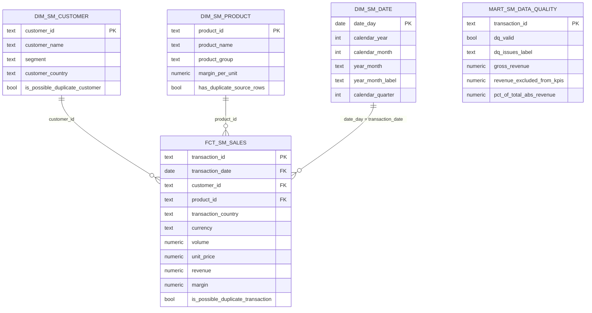

# Data Model — Supply & Marketing Reporting

## Diagram

`mart_sm_data_quality` sits outside the star on purpose: it reports on rows the
fact table deliberately excludes, so it reads from staging rather than from
`fct_sm_sales`.

## Fact table

**`fct_sm_sales`** — grain: one row per source transaction (`transaction_id`).

Only rows that passed the staging data quality rules are included. This is the
single conformed fact behind every headline KPI, so revenue by country, volume by
product, margin by product group and top customers are guaranteed to reconcile
with each other.

## Dimensions

| Dimension | Grain | Notes |
|---|---|---|
| `dim_sm_customer` | one row per customer | Includes an `Unknown Customer` (`-1`) member. Carries `is_possible_duplicate_customer`. |
| `dim_sm_product` | one row per product | Deduplicated from the source file. Enriched with `margin_per_unit`, so margin is a simple fact-side multiplication. Includes an `Unknown Product` (`-1`) member. |
| `dim_sm_date` | one row per calendar day | Generated across the observed transaction range so trend charts show gaps as gaps rather than skipping absent days. |

## Key business measures

| Measure | Definition | Source |
|---|---|---|
| Revenue | `quantity * unit_price` | `fct_sm_sales.revenue` |
| Volume | `quantity` | `fct_sm_sales.volume` |
| Margin | `quantity * margin_per_unit` | `fct_sm_sales.margin` |
| Margin % | `sum(margin) / nullif(sum(revenue), 0)` | derived in the BI layer |
| Revenue excluded by data quality | `abs(gross_revenue)` of flagged rows | `mart_sm_data_quality` |

## Design decisions

**A star schema, not pre-aggregated KPI tables.** The five requested views are all
slices of the same grain. Building one conformed fact and letting the BI layer
aggregate keeps the numbers mutually consistent; a table per KPI would drift the
moment one of them was changed in isolation.

**Margin lives on the product dimension.** `Margin.xlsx` is a per-product
attribute, not an event, so it is modelled as a dimension attribute rather than a
second fact. Margin then becomes a multiplication on the fact row instead of a
join at query time.

**Quality rules are applied in staging, not in the marts.** Staging decides what
is trustworthy and records why; the marts only apply that decision. This keeps
the rules in one auditable place instead of repeated across reporting queries.

**Unknown members instead of dropped keys.** Dimensions carry a `-1` Unknown
member so flagged rows can still be described in the data quality view without
breaking referential integrity or silently disappearing.

**Two near-duplicate problems handled differently.** The duplicate `ProductID` is
deduplicated because a repeated dimension key is a structural defect that would
fan out fact rows. The near-identical customer names are kept and flagged,
because both keys are valid and deciding they are one company is a business call
this data cannot support. See `data_assessment.md`.

## Known caveat to raise with the business

`Aral AG` is currently the top customer by revenue (180,000), and that figure
comes entirely from transactions 1007 and 1008 — the pair flagged as possible
duplicates. If the business confirms they are one booking, the top-customer
ranking changes. The pipeline reports the value and the doubt rather than
silently picking one interpretation.
