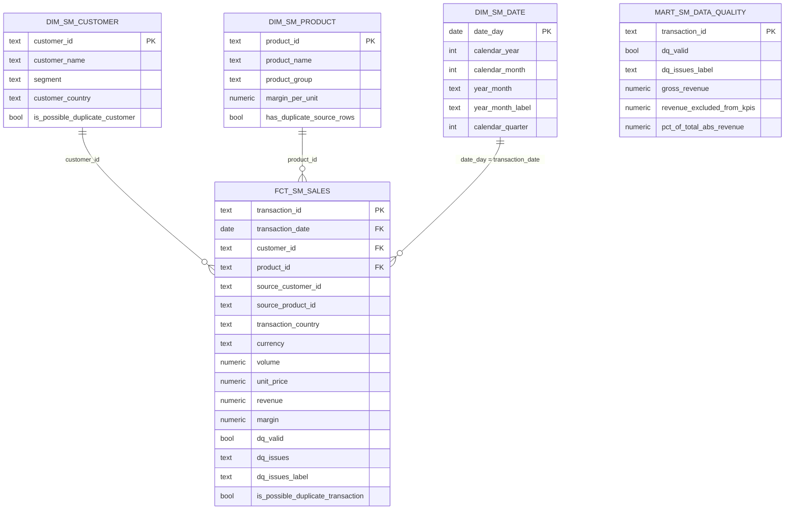

# Data Model — Supply & Marketing Reporting

## Diagram

`mart_sm_data_quality` sits outside the star on purpose. It reads from staging
rather than from `fct_sm_sales` and carries the revenue-share measures
(`pct_of_total_abs_revenue`, `total_abs_revenue`) that the fact has no reason to
hold, so it remains the dedicated row-level quality view.

## Fact table

**`fct_sm_sales`** — grain: one row per source transaction (`transaction_id`).

**Every source transaction is present, including rows that failed a data quality
rule.** `dq_valid` marks the rows fit for headline reporting. The fact therefore
describes its own completeness: a consumer can see both what was measured and
what was set aside, without needing a second table to discover that anything was
withheld.

This is the single conformed fact behind every headline KPI, so revenue by
country, volume by product, margin by product group and top customers are
guaranteed to reconcile with each other — provided they apply the same
`dq_valid` filter, which the dashboard enforces centrally with one filter widget
rather than per card.

## Dimensions

| Dimension | Grain | Notes |
|---|---|---|
| `dim_sm_customer` | one row per customer | Includes an `Unknown Customer` (`-1`) member. Carries `is_possible_duplicate_customer`. |
| `dim_sm_product` | one row per product | Deduplicated from the source file. Enriched with `margin_per_unit`, so margin is a simple fact-side multiplication. Includes an `Unknown Product` (`-1`) member. |
| `dim_sm_date` | one row per calendar day | Generated across the observed transaction range, padded out to whole calendar months (Jan 2026 → 31 rows). The Revenue Trend card is driven from this dimension with a left join to the fact, so days with no sales plot as zero instead of being skipped. 23 of the 31 days currently have no transactions. |

## Key business measures

All four headline measures are `dq_valid = true` slices of the fact. The filter
is applied once, at the dashboard level, rather than being baked into the model.

| Measure | Definition | Source |
|---|---|---|
| Revenue | `quantity * unit_price` | `fct_sm_sales.revenue` |
| Volume | `quantity` | `fct_sm_sales.volume` |
| Margin | `quantity * margin_per_unit` | `fct_sm_sales.margin` |
| Margin % | `sum(margin) / nullif(sum(revenue), 0)` | derived in the BI layer |
| Revenue excluded by data quality | `abs(gross_revenue)` of flagged rows | `mart_sm_data_quality` |

## Design decisions

**A star schema, not pre-aggregated KPI tables.** The five requested views are all
slices of the same grain. Building one conformed fact and letting the BI layer
aggregate keeps the numbers mutually consistent; a table per KPI would drift the
moment one of them was changed in isolation.

**Margin lives on the product dimension.** `Margin.xlsx` is a per-product
attribute, not an event, so it is modelled as a dimension attribute rather than a
second fact. Margin then becomes a multiplication on the fact row instead of a
join at query time.

**Quality rules are applied in staging, not in the marts.** Staging decides what
is trustworthy and records why; the marts only apply that decision. This keeps
the rules in one auditable place instead of repeated across reporting queries.

**Unknown members instead of dropped keys.** Dimensions carry a `-1` Unknown
member, and fact rows now point at it. Where a transaction has a missing or
unresolvable `CustomerID`, or a `ProductID` absent from the product master, the
fact stores `-1` as the conformed key and keeps the original in
`source_customer_id` / `source_product_id`. The row joins cleanly, appears under
an explicit "Unknown" label in any dimensional breakdown, and referential
integrity holds.

This is what makes the `not_null` and `relationships` tests on the fact
meaningful rather than tautological. Before, they passed because the offending
rows had been filtered out; now they pass because the keys are genuinely
resolved, and they will fail loudly if the resolution is ever broken. They are
the regression guard for this design, not decoration.

**Keys are resolved in the mart, not in staging.** Staging records *what is
wrong* with a row; the mart decides *what to do about it*. The resolution reuses
the `issue_*` booleans staging already computed rather than re-deriving
dimension membership, so there is exactly one definition of "unknown customer"
in the codebase.

**"Country" means the transaction's country, not the customer's.** The source provides
both: `sales.csv` carries a `country` per transaction (landed as
`fct_sm_sales.transaction_country`) and `Customers.xlsx` carries one per customer
(`dim_sm_customer.customer_country`). Reporting uses the transaction's.

Three reasons. It is an attribute of the event being measured, so it belongs on the
fact as a degenerate dimension and needs no join. It is the only country available for
a transaction whose customer cannot be resolved — under the customer's country, those
rows would report as "Unknown" rather than where the sale actually happened. And it
answers the question "where is our revenue coming from?" in the operational sense
Supply & Marketing means by it.

**In this data the choice is almost immaterial, and it is worth being precise about
why.** The two fields agree on every transaction with a resolvable customer. They
diverge on exactly one row — transaction 1009, which has no customer at all — and only
in the unfiltered view:

| View | By `transaction_country` | By `customer_country` |
|---|---|---|
| Default (`dq_valid = true`) | DE 361,600 | DE 361,600 |
| Filter cleared | DE 374,000 | DE 358,400 + Unknown 15,600 |

So no published figure depends on the choice. The source data contains no evidence of a
ship-to / bill-to distinction; the only divergence is an artefact of a missing customer
key, not of a customer buying in another country.

The assumption is enforced rather than merely observed:
`tests/assert_sm_transaction_country_matches_customer.sql` fails the build if a
transaction with a known customer is ever recorded against a different country than that
customer. If that test starts failing, the source has begun making a distinction this
model does not, and the reporting definition needs revisiting with the business.

**Two near-duplicate problems handled differently.** The duplicate `ProductID` is
deduplicated because a repeated dimension key is a structural defect that would
fan out fact rows. The near-identical customer names are kept and flagged,
because both keys are valid and deciding they are one company is a business call
this data cannot support. See `data_assessment.md`.

**The date dimension only spans observed data.** `dim_sm_date` is generated from the
min and max transaction dates, padded to whole months. Days and interior months with no
sales are present and plot as zero, because `generate_series` runs continuously across
the span. But periods *outside* the observed range do not exist — with only January 2026
in the source, a full-year 2026 trend is not expressible. A production build would drive
this from a configured calendar range rather than from the data, so the dimension does
not depend on the facts it is meant to describe. Called out because a date dimension
derived from observed data is a genuine modelling compromise, not an oversight.

Note that for the same reason, a `relationships` test from `fct_sm_sales.transaction_date`
to `dim_sm_date.date_day` would be **circular and is deliberately not present**: the
dimension is defined as the span of those very dates, so such a test could never fail.
Date integrity is asserted upstream by `not_null` on `stg_sm_sales.transaction_date`.

## Monitoring and failure behaviour

The DAG runs `dbt build`, not `dbt run` followed by `dbt test`. The distinction matters:
with run-then-test, every model is materialised before any test executes, so a failing
test means invalid data is already live in `mart` and only the docs publish is skipped —
invisible to anyone reading the dashboard. `dbt build` tests each model as it is built
and skips everything downstream of a failure.

`mart_sm_pipeline_status` depends on the fact and both dimensions, so it is skipped
whenever their tests fail. Its `validated_at` therefore records the last time the marts
*passed validation*, and the dashboard's "Data validated" card goes visibly stale when
they do not. That is the consumer-facing failure signal.

**Still missing, and worth stating plainly:** there is no alerting. No
`on_failure_callback`, no email, no paging — a failure is visible to someone who looks
at the dashboard or at Airflow, but nothing pushes. A production deployment needs
`on_failure_callback` wired to a real channel.

## Known caveat to raise with the business

`Aral AG` is currently the top customer by revenue (180,000), and that figure
comes entirely from transactions 1007 and 1008 — the pair flagged as possible
duplicates. If the business confirms they are one booking, the top-customer
ranking changes. The pipeline reports the value and the doubt rather than
silently picking one interpretation.
