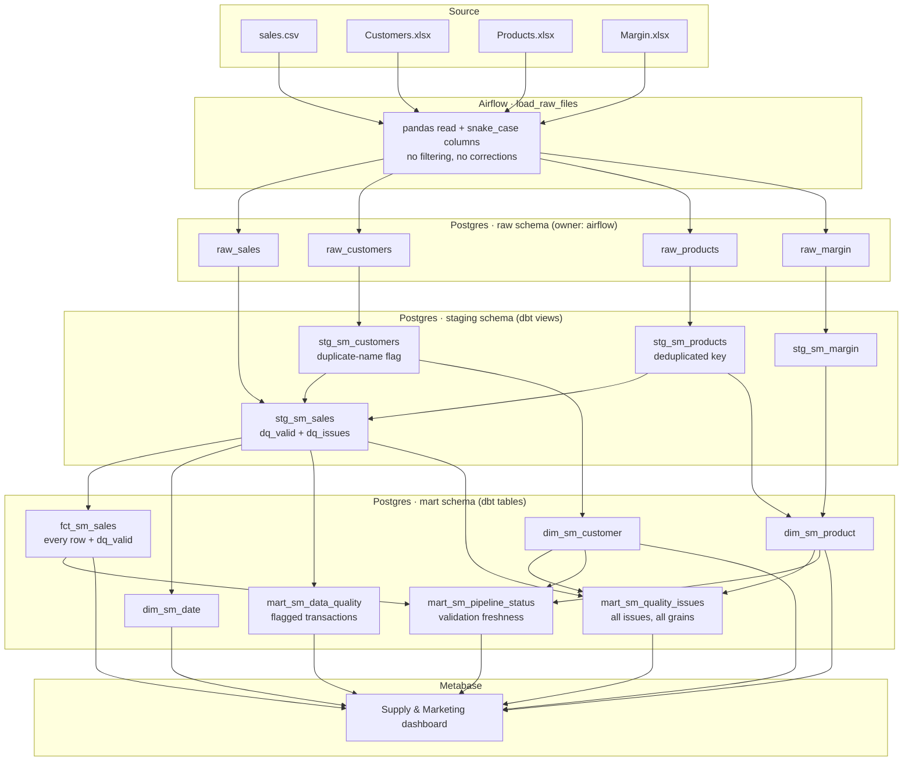

# Data Lineage — Source to KPI

## End-to-end flow

`mart_sm_quality_issues` reads the dimensions as well as staging, because master data
problems (`C007`/`C008`, `P300`) live on the dimensions rather than on any transaction.
`mart_sm_pipeline_status` depends on the fact and both dimensions so that `dbt build`
skips it whenever their tests fail — that dependency is what makes its timestamp a
validation signal rather than a run timestamp.

`stg_sm_customers` and `stg_sm_products` feed back into `stg_sm_sales` because
the unknown-key checks test sales rows against the conformed master data.

## Worked example: "Revenue by country — Germany"

| Stage | Artefact | What happens | Value |
|---|---|---|---|
| Source file | `sales.csv` | 12 rows, `;` separated, `DD.MM.YYYY` dates | 12 rows |
| Raw dataset | `raw.raw_sales` | Loaded verbatim, all columns text, `_source_file` / `_loaded_at` added | 12 rows |
| Transformation | `staging.stg_sm_sales` | Types cast, dates parsed, quality rules applied. 1009, 1010 and 1012 marked `dq_valid = false`; 1007/1008 flagged but kept valid | 12 rows, 9 valid |
| Reporting model | `mart.fct_sm_sales` | Every row retained, `revenue = quantity * unit_price`, unresolvable keys routed to `-1` | 12 rows, 9 with `dq_valid = true` |
| Dashboard | Metabase "Revenue by Transaction Country" | `sum(revenue) group by transaction_country`, with the `dq_valid` filter at its default | DE 361,600 |
| KPI | Revenue — Germany | | **361,600 EUR** |

Reconciliation for DE: 52,000 + 41,600 + 36,000 + 90,000 + 90,000 + 52,000 = 361,600.

Note where the filtering happens: the fact table carries all 12 rows, and the dashboard
applies `dq_valid = true`. Clearing that filter raises Germany to 374,000 — the same
model, a different question.

The flagged German rows are visible in the data quality view: 1009 (15,600 missing
customer), 1010 (4,000 unknown product) and 1012 (7,200 negative quantity). Germany's
reported revenue is therefore 361,600 with 26,800 identified and accounted for, not
silently lost. All three flagged transactions happen to be German, so the 26,800 here is
the same figure as the platform-wide "Revenue Excluded by Data Quality" KPI.

The 374,000 is not 361,600 + 26,800, because 1012 carries a negative quantity and
subtracts. "Revenue excluded" uses absolute value deliberately: it measures exposure,
not a reconciling difference.

## Lineage in tooling

dbt resolves every dependency above through `ref()` and `source()`, so
`dbt docs generate` produces a navigable lineage graph. The pipeline publishes it
to nginx on each run, and the Metabase dashboard is registered as a dbt exposure
so the graph extends from source file to dashboard rather than stopping at the
mart.
